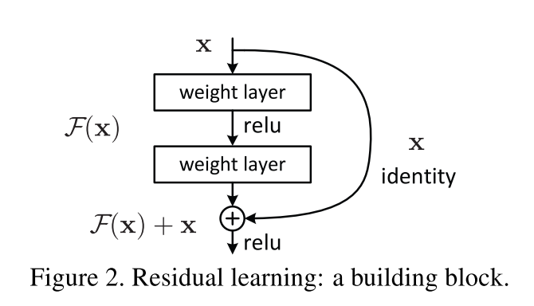
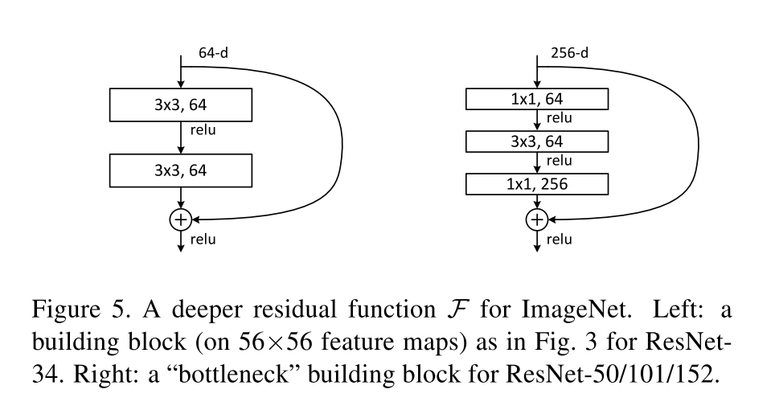

# [Deep Residual Learning for Image Recognition](https://arxiv.org/abs/1512.03385)

Tags: task.object_classification, task.object_detection, task.object_localization, task.instance_segmentation  
Date: 12/10/2015  

- The authors are motivated to explore the training of deep networks, and in particular how to address the problem of training accuracy degradation in deep networks
    - The degradation problem is particularly interesting in that in theory, additional layers of a deeper model should be able to simply learn an identity mapping and thus produce the same results as a more shallow network. In practice, this is not the case.
- The authors propose a deep residual learning framework
    - In this framework, every set of a few stacked layers are explicitly trained to fit a residual mapping, as opposed to hoping they fit a desired underlying mapping (as is true in a non residual learning framework)
        - This is realized by simply adding "shortcut connections" that simply perform the *identity* mapping. This allows for their outputs to be added to the outputs of the stacked layers to learn a residual.
        - The shortcut connections introduce neither extra parameter nor computation complexity
        - In their formulation, their residual blocks have 2 / 3 layers. Each residual block could have more or less, but in practice they did not observe advantages for residual blocks with a single layer (which are similar to a linear layer).
    - They hypothesize that if the optimal function of additional layers in a deep network is closer to an identity mapping than a zero mapping, the shortcut connection / residual framework formulation should make it easier to learn the weights, since it acts as an identity mapping reference point
- They test their method on CIFAR-10 object classification, ImageNet object classification, ImageNet object detection, PASCAL object detection, COCO object detection, and COCO instance segmentation
    - For ImageNet object classification, they compare against a VGG-19 network as well as a plain network without residual connections. For the plain network, they compare against 18 and 34 layer versions.
        - For the 18 and 34 layer versions of the plain net, they observe the degradation problem, where the 34 layer network has higher training error than the 18 layer network.
        - For the 18 and 34 layer versions of the residual networks, they *do not* observe the degradation problem, and the 34 layer ResNet is better than the 18 layer ResNet.
        - They note that the 18 layer ResNet converges faster than the 18 layer plain network.
        - Their single model ResNet-152 outperforms all other single models on the validation set, and their ensemble wins 1st place for the object classification challenge
    - With CIFAR-10, they find that the ResNet networks are again able to overcome the degradation problem, while the plain networks are not
    - For PASCAL VOC 2007 and 2012 object detection, ResNets show significant performance gains over VGG-16
    - For the COCO object detection and instance segmentation challenges, they won 1st place
    - For the ImageNet localization challenge, they won 1st place
- Through training / experimentation, they note:
    - The learned residual functions in general have small responses, suggesting that the identity mapping provides reasonable preconditioning
    - There is not a large difference between using projection or identity shortcuts
    - To improve training time, they modify the building block to be a *bottleneck* design; instead of having two 3x3 layers, they use a 1x1, 3x3, and 1x1 layer (where the 1x1 layers decrease and increase dimensions). They use identity projections in these modules, and projection shortcuts only when they need to increase dimensions.
    - The largest of their networks, the 152 layer ResNet, still has lower complexity than VGG-16/19
    - They are able to successfully train a 1202 layer network; its training error is still extremely low, as is its test error. But, its test error is higher than the 110 layer network, likely because of heavier overfitting.

## General Residual Block

## Bottleneck Residual Block

